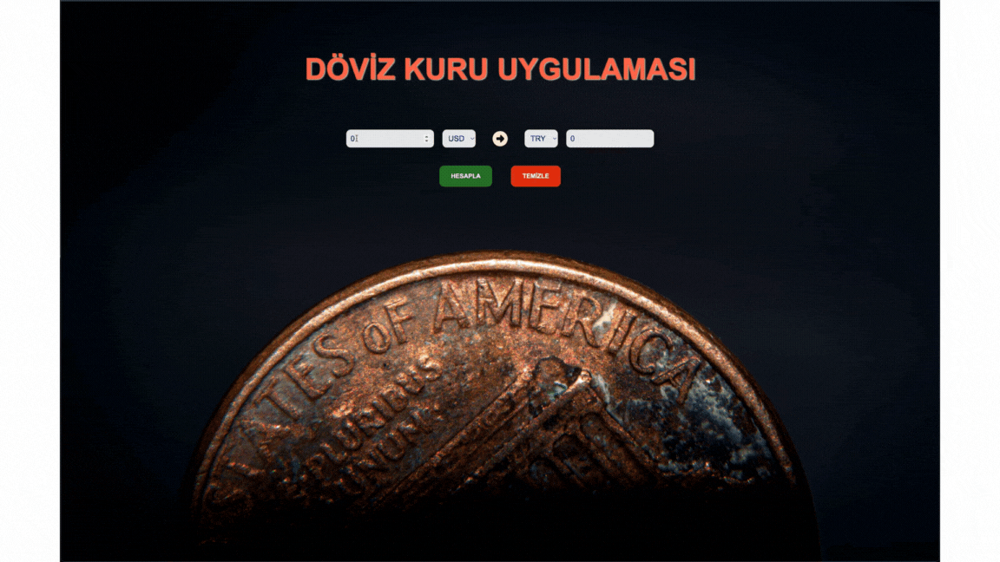

1. Proje Başlangıcı:

İlk olarak, React projesi oluşturduk ve gerekli paketleri yükledik. Proje dosyalarını oluşturduktan sonra, uygulamamızı başlatmak için gerekli adımları tamamladık.

2. Temel bileşenlerin Oluşturulması:

Uygulamamızın ana bileşeni olan Currency bileşenini oluşturduk. Bu bileşen, kullanıcı arayüzünü oluşturan HTML ve CSS ile birlikte React bileşenlerini içerir.

3. State Yönetimi:

useState kancalarını kullanarak, miktar, dönüştürülecek para birimi, hedef para birimi ve dönüştürülen miktar gibi değişkenleri sakladık. Bu sayede, kullanıcının girdilerini izleyebilir ve güncelleyebiliriz.

4. Kullanıcı Girişi ve Değişim İşlevleri:

Kullanıcı girişlerini izlemek ve güncellemek için işlevler oluşturduk. Bu işlevler, kullanıcının miktarı, dönüştürülecek para birimini ve hedef para birimini seçmesine olanak tanır. Ayrıca, hesaplama ve temizleme işlevlerini de tanımladık.

5. Döviz Kuru Hesaplama:

exchange adlı bir asenkron işlev oluşturduk. Bu işlev, API'ye istek gönderir ve döviz kurlarını alır. Ardından, seçilen miktarı belirtilen para birimine dönüştürür ve sonucu günceller.

6. Kullanıcı Arayüzü:

Kullanıcı arayüzünde, miktar ve para birimi seçim alanları ile hedef para birimi seçim alanı ve sonuç gösterme alanını oluşturduk. Ayrıca, hesapla ve temizle butonlarını da ekledik.

7. Stil ve Görsel İyileştirmeler:

CSS dosyaları kullanarak, uygulamanın görünümünü iyileştirdik. Böylece, kullanıcılar arayüzde daha iyi bir deneyim yaşayabilirler.
# gif

